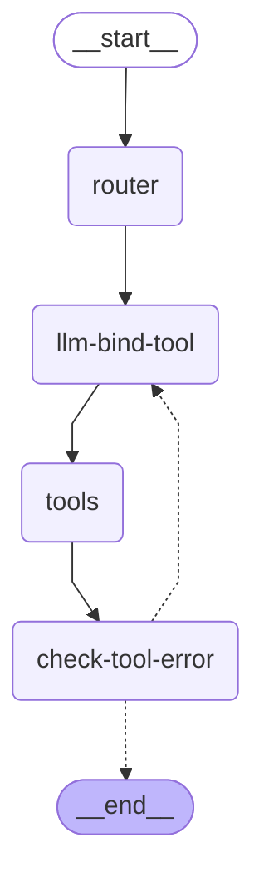

# Personal finance management

## Quick Start

```bash
# 1. Clone and set up the environment
git clone https://github.com/LamKser/personal-finance-manager.git
cd personal-finance-manager

# Create the conda environment and install dependencies
conda env create -f environment.yml
conda activate tele

# 2. Configure your local environment
cp .env.example .env
# Edit .env with your LLM, embedding and Google Sheet credentials

# 3. Run the agent
python main.py --prompt="Lấy thông tin giao dịch tháng 7"

-s, --stream: Streaming final response

# 4. FastAPI
uvicorn src.api:app
```

## Installation

### Google Sheet Access

The tools read a Google Sheet via `gspread` using a service-account JSON:

```bash
# Point CREDENTIAL at your service-account file and SHEET_KEY at the sheet
CREDENTIAL=path/to/service_account.json
SHEET_KEY=your_spreadsheet_key
```

## Architecture

### System Overview




The graph shows the agent's execution flow as a LangGraph state machine:

- **`router`**: Decides which tool(s) to use for the user's query.
- **`llm-bind-tool`**: Binds the selected tool(s) and composes the call.
- **`tools`**: The chosen tool is executed.
- **`check-tool-error`**: Check if tool is error. If a tool failed, the flow loops back to **`llm-bind-tool`** to retry with a corrected call (up to `MAX_TOOL_RETRY`). Once the tool succeeds, control also returns to **`llm-bind-tool`**, which now generates the final natural-language response.
